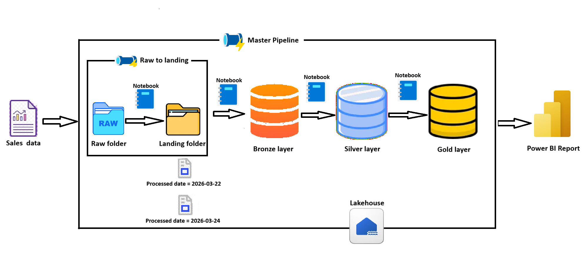
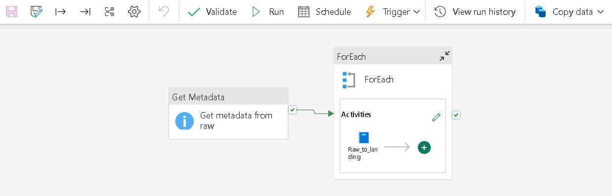
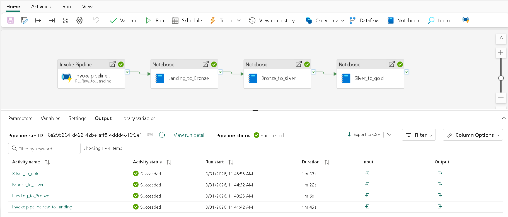
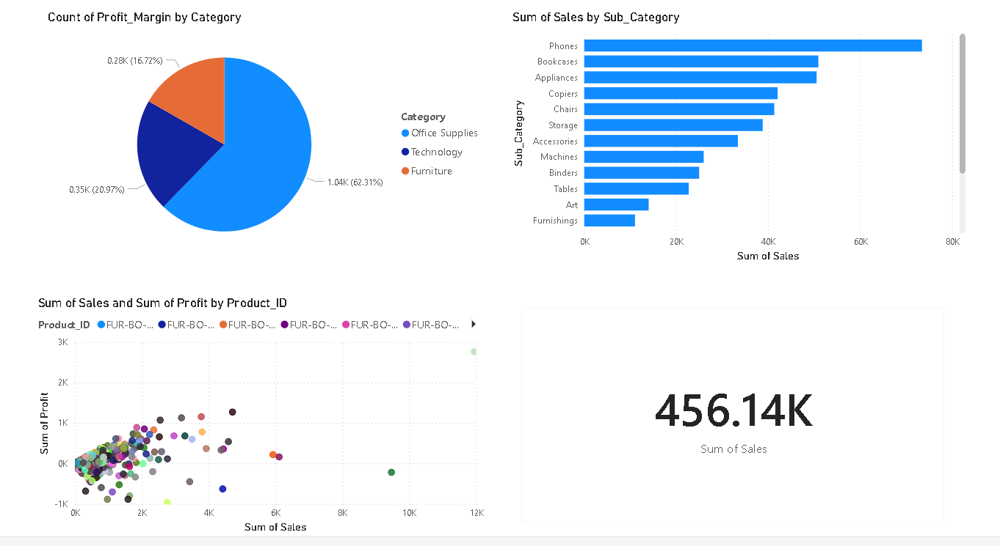
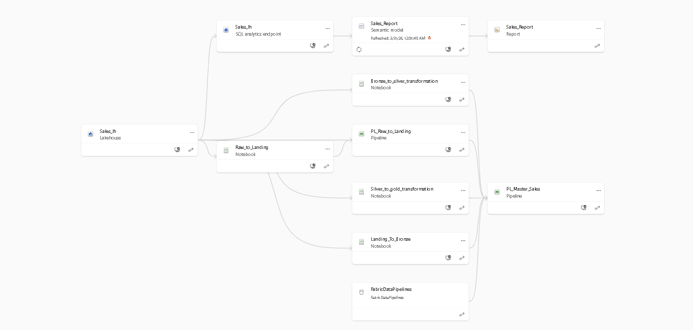

# 🏗️ End-to-End Sales Data Pipeline — Microsoft Fabric

> A fully automated, incremental data pipeline built on **Microsoft Fabric**, transforming raw sales data through a **Medallion Architecture** (Raw → Landing → Bronze → Silver → Gold) and delivering insights via **Power BI**.

---

## 📌 Project Overview

This project implements a production-grade **end-to-end data engineering pipeline** using Microsoft Fabric's Lakehouse architecture. Sales data is ingested from a raw folder, incrementally processed through multiple transformation layers, and finally exposed through a Power BI semantic model for business reporting.

---

## 🗂️ Folder Structure

```
📦 END-TO-END SALES DE PIPELINE
├── 📁 datasets/
│   ├── 2016 Apr.csv
│   ├── 2016 Feb.csv
│   ├── 2016 July.csv
│   ├── 2016 Jun.csv
│   ├── 2016 Mar.csv
│   └── 2016 May.csv
│
├── 📁 notebooks/
│   ├── Raw_to_Landing.ipynb              # Incremental load: Raw → Landing
│   ├── Landing_To_Bronze.ipynb           # Incremental load: Landing → Bronze schema
│   ├── Bronze_to_silver_transformation.ipynb  # Transformations: Bronze → Silver schema
│   └── Silver_to_gold_transformation.ipynb    # Dim/Fact tables: Silver → Gold schema
│
├── 📁 pipelines/
│   ├── PL_Raw_To_Landing.json            # Pipeline: Raw folder ingestion
│   └── PL_Master_Sales.json              # Master pipeline: End-to-end orchestration
│
├── 📁 report/
│   ├── project flow.txt
│   └── Sales_Report.pbix                 # Power BI report file
│
├── .env
└── .gitignore
```

---

## 🏛️ Architecture



The pipeline follows the **Medallion Architecture** pattern inside a single **Microsoft Fabric Lakehouse**:

| Layer | Description |
|-------|-------------|
| **Raw Folder** | Source CSV files uploaded manually or via automation |
| **Landing Folder** | Staged data after initial validation and incremental load check |
| **Bronze Layer** | Raw data loaded into Lakehouse tables (schema-on-read) |
| **Silver Layer** | Cleaned and transformed data with business logic applied |
| **Gold Layer** | Star schema with Dimension & Fact tables ready for reporting |
| **Power BI Report** | Connected via Semantic Model for interactive dashboards |

---

## ⚙️ Pipeline Workflow

### Pipeline 1 — `PL_Raw_To_Landing`
Triggered when new files arrive in the **Raw** folder:
1. **Metadata Activity** — Checks if the Raw folder contains new/unprocessed files
2. **ForEach Activity** — Iterates over each new file
3. **Notebook Activity** — Runs `Raw_to_Landing.ipynb` for each file using incremental loading logic



### Master Pipeline — `PL_Master_Sales`
Orchestrates the full data flow end-to-end:
```
Invoke PL_Raw_To_Landing → Landing_To_Bronze → Bronze_To_Silver → Silver_To_Gold
```
All four stages run sequentially and were validated with ✅ **Succeeded** status.



---

## 📓 Notebooks

| Notebook | Purpose |
|----------|---------|
| `Raw_to_Landing.ipynb` | Reads new files from the Raw folder and writes them to the Landing folder using incremental load (checks `processed_date`) |
| `Landing_To_Bronze.ipynb` | Loads Landing data into the Bronze schema in the Lakehouse table with incremental logic |
| `Bronze_to_silver_transformation.ipynb` | Applies data cleaning, type casting, and business transformations; writes to Silver schema incrementally |
| `Silver_to_gold_transformation.ipynb` | Creates Dimension tables and Fact tables from Silver data for use in Power BI (incremental load) |

---

## 📊 Power BI Reporting

- A **Semantic Model** was created connecting the Gold layer Fact and Dimension tables
- Relationships were defined and validated within the model
- A **Sales Report** (`Sales_Report.pbix`) was built on top of the semantic model
- The report was **published back to Power BI Service**



---

## 🚀 How to Run

### Prerequisites
- Microsoft Fabric workspace with Lakehouse enabled
- Power BI Desktop (for local report editing)

### Steps

1. **Upload data** — Place CSV files into the `datasets/` folder or directly into the Lakehouse Raw folder
2. **Run the Raw-to-Landing pipeline** — Trigger `PL_Raw_To_Landing` manually or via schedule/event trigger
3. **Run the Master pipeline** — Trigger `PL_Master_Sales` to execute the full Bronze → Silver → Gold transformation chain
4. **Verify the output** — Check Lakehouse tables in the Bronze, Silver, and Gold schemas
5. **Refresh the Semantic Model** — Update the Power BI semantic model to reflect the latest Gold layer data
6. **View the Report** — Open `Sales_Report.pbix` or access the published report in Power BI Service

---

## 🔄 Incremental Loading Strategy

All notebooks implement **incremental loading** using a `processed_date` watermark:
- On each run, only **new or unprocessed records** are picked up
- The last processed date is tracked to avoid reprocessing
- This ensures efficiency and idempotency across pipeline runs

---

## 🛠️ Tech Stack

| Tool | Usage |
|------|-------|
| **Microsoft Fabric** | Lakehouse, Notebooks, Data Pipelines |
| **PySpark / Python** | Data transformation in notebooks |
| **Delta Lake** | Storage format for Lakehouse tables |
| **Power BI** | Semantic model and reporting |
| **Git** | Version control for notebooks, pipelines, and reports |

---

## 📸 Screenshots



---

## 📄 License

This project is intended for educational and portfolio purposes.

---

> Built with ❤️ using Microsoft Fabric | Medallion Architecture | Power BI